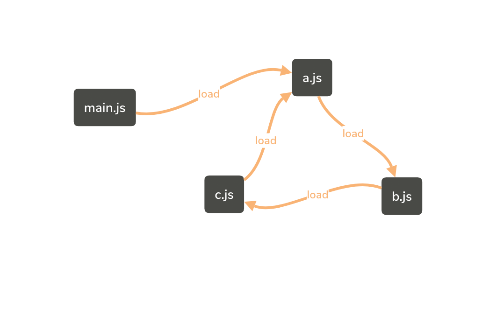

# define模块详细使用

## 直接定义模块

下面的几种都是直接定义模块内容

```javascript
// test1
define({
    val:"I am test1"
});
```

```javascript
// test2
define("I am test2");
```

```javascript
// test3
define(function(){
    return 'I am test3';
});
```

```javascript
// test4
define(new Promise(res =>{
    res('I am test4');
});
```

```javascript
// test5
define(function(){
    return new Promise(res =>{
        res('I am test5');
    });
});
```

```javascript
// test6
define(async()=>{
    return 'I am test6';
});
```

前两种是直接定义模块内容；

test1 定义的模块内容是一个带有 val属性的对象；

test2 模块内容是字符串；

test3 是通过函数返回模块内容，跟 `AMD模块` 一样，模块内容是字符串；

test4 test5 test6 都是获得Promise对象，等Promise对象进入`fulfilled`状态后，完成模块文件的定义；

也可以使用 `CMD模块化` 的方式定义模块

```javascript
// test7
define(async (load, exports, module)=>{
    module.exports = "I am test7";
});
```

先说明一下， **test6** 才是 `drill.js` 经常使用的`define模块`写法；

## 依赖其它模块

与AMD模块规范不同，`drill.js` 的模块依赖是通过内部 `load` 引用的，如下：

```javascript
define(async (load)=>{
    const d1 = await load('js/d1');

    // etc...
});
```

## 相对路径

默认的情况下，`load` 都是以根目录为准；但在模块内，我们可以使用相对目录；

目录结构

* index.html
* js/
    * drill.js
    * definedir/
        * d1.js
        * d2.js

`d1.js`↓

```javascript
define({
    val:"I am d1.js"
});
```

`d2.js`↓

```javascript
define(async (load) => {
    // let d1 = await load('js/definedir/d1');
    let d1 = await load('./d1');

    return {
        val: "I am d2.js",
        d1_val: d1.val
    };
});
```

`index.html`↓

```html
<!DOCTYPE html>
<html lang="en">

<head>
    <meta charset="UTF-8">
    <title>01-5</title>
    <script src="js/drill.js"></script>
</head>

<body>
    <script>
    (async ()=>{
        // let [d1,d2] = await load('js/definedir/d1','js/definedir/d2');

        let d1 = await load('js/definedir/d1');

        console.log(d1.val);

        let d2 = await load('js/definedir/d2');

        console.log(d2.val);
    })();
    </script>
</body>

</html>
```

`d2.js`里，使用 `./` 代表当前js文件所处的目录；

当然还能使用 `../` 上级目录，但是上级引用最大不能超过根目录；

## 定义id

通过 `define` 函数的第二个参数，给模块定义id

```javascript
// a.js
define(async()=>{
    return 'I am test6';
},'test6');
```

```javascript
// 载入 a.js
let a1 = await load('js/a');

let a2 = await load('test6');
```

这里的a1和a2值是相等的；

必须先载入 a.js ，才能使用test6这个模块名；若a1 a2 顺序调转，则会报错；

### 注意

模块间的依赖不能形成闭环，闭环依赖会走不出死循环;



上面的 a.js b.js c.js 就是错误示范了；

[task模块 →](03.md)